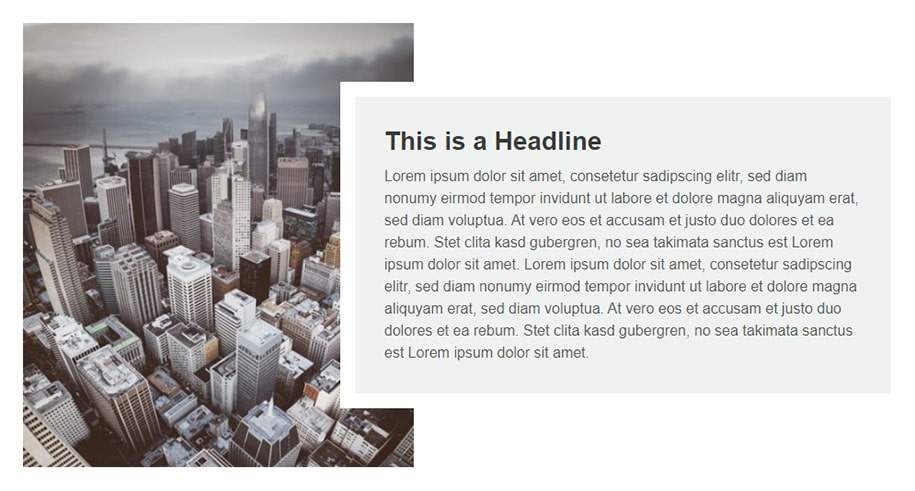

# Code challenge: HTML / CSS

The following task was one part of a more complex code challenge for front-end web developers by a German company.

## Task

- Build the structure of the following picture
- Create everything only with HTML and CSS
- You can use dummy content for the image and text
- **Requirement**: The structure must be flexible based on the content of the gray box. If the text should get longer, the height of the image has to be adjusted accordingly.

## Live demo of my solution

Live demo: [https://html-css-task.now.sh/](https://html-css-task.now.sh/)

## Additional features

Responsive Design with media queries: I added style adjustments for three additional device breakpoints to optimize the view on mobile devices.  
On click the text container is editable to make it more comfortable to test the adjustments of the image with longer or shorter text.

---

Code by [Peter R. Stuhlmann](https://peter-stuhlmann-webentwicklung.de).  
Photo by [Denys Nevozhai](https://unsplash.com/@dnevozhai).
